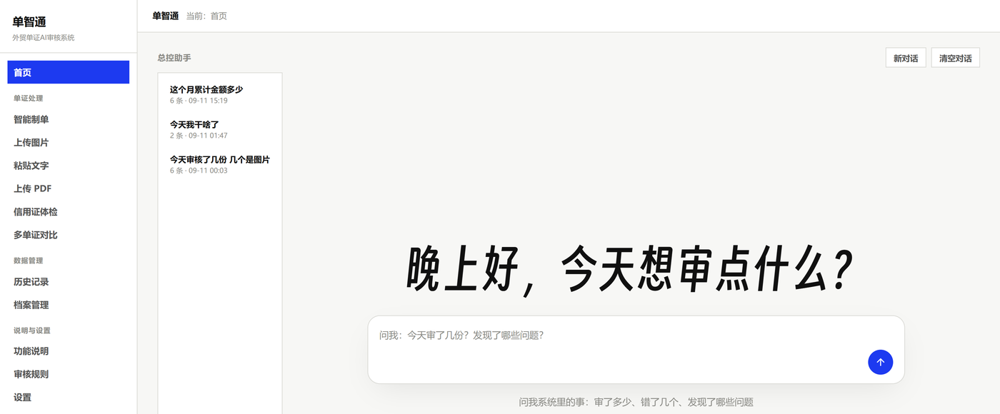
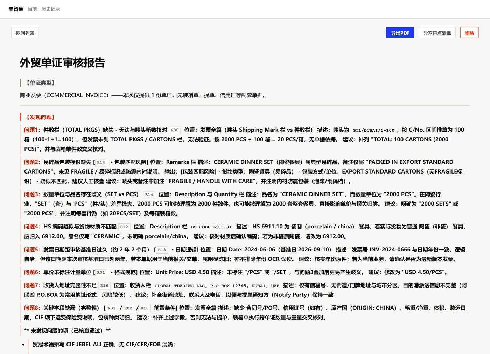
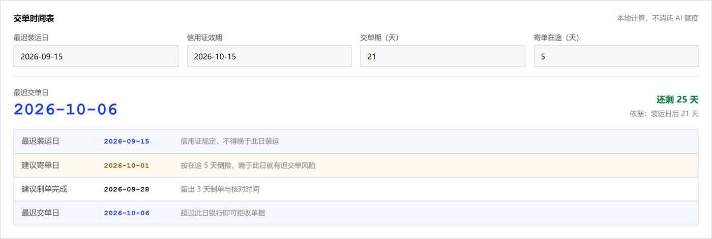
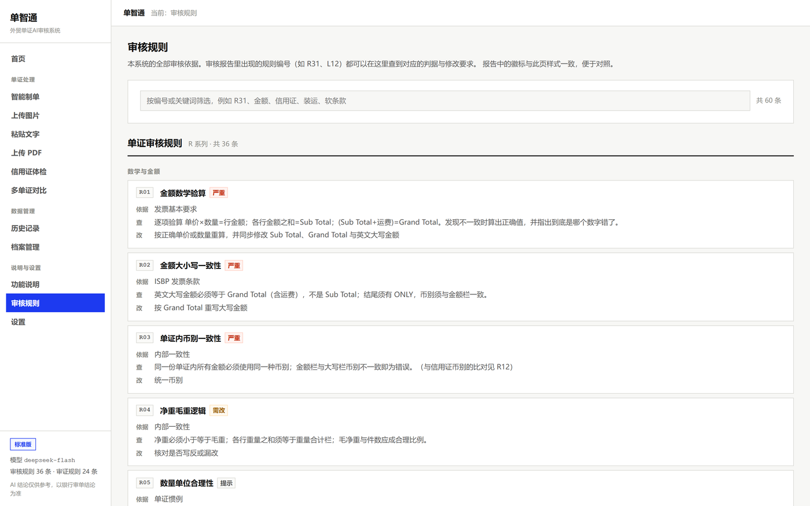
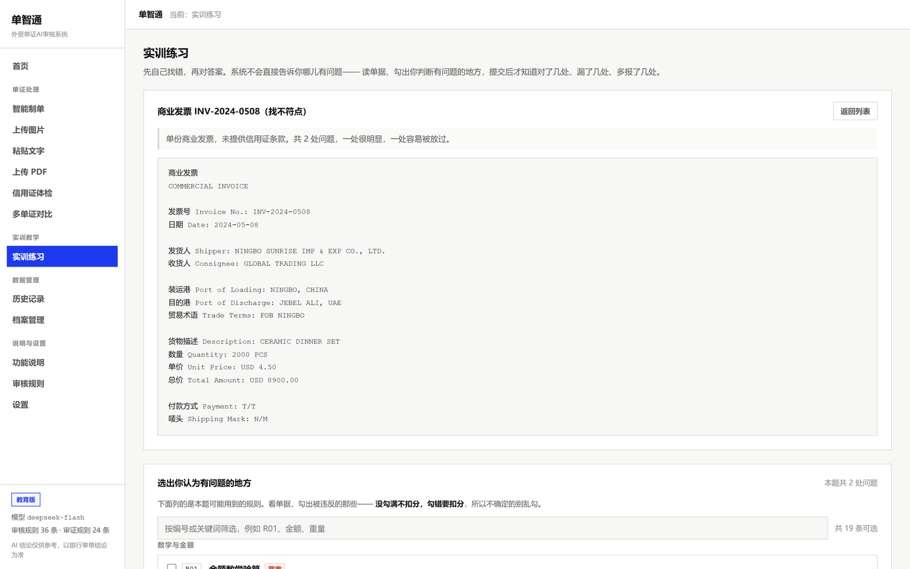
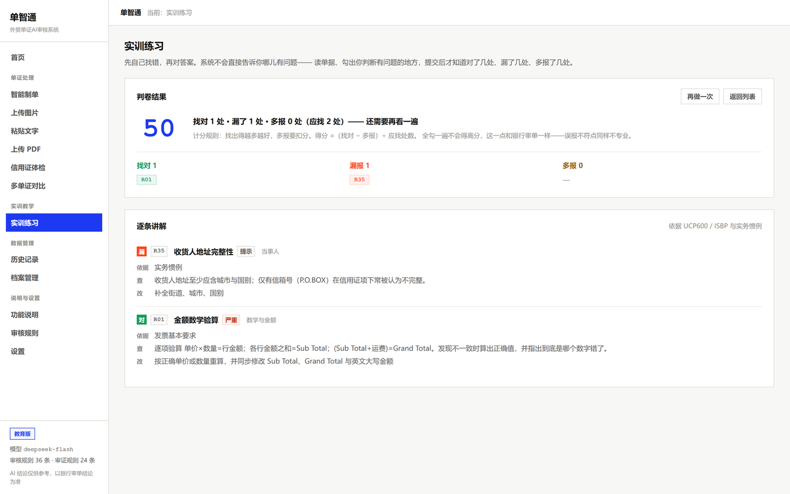

# 单智通 · 外贸单证智能审核系统

把 UCP600 与 ISBP 的审核知识写成 60 条可执行的规则，逐条核对外贸单证与信用证，
**每一条结论都标出命中的规则编号，可以顺着编号查回依据。**

面向出口企业的单证员与外贸业务员，也可用于职业院校外贸单证课程的实训教学。



---

## 它解决什么问题

一份商业发票涉及金额大小写、币别一致性、贸易术语、唛头、件重尺逻辑等二十余个检查点。
人工逐份核对很慢，而信用证结算方式下更麻烦——**信用证里的软条款和时间陷阱，
只有审证才能发现，单据做得再完美也补不回来**。

市面上不缺「把单据丢给大模型问哪里有问题」的工具，但那样得到的是一个黑箱结论。
单证工作的特殊性在于：**结论必须有依据，而且依据要能被核对**。银行拒付不会说
「AI 觉得不对」，它会指出违反了 UCP600 的哪一条。

所以这个项目的做法是：先把审核知识显性化成规则表，再让模型按规则逐条核对。

---

## 功能

### 单证审核
粘贴文字、上传图片或扫描版 PDF（图片与 PDF 先经 OCR），输出固定的六段式报告：
单证类型 / 发现问题 / 数学验算 / 风险提示 / 审核结论 / 本轮执行。



报告里的 `R08`、`R14` 这样的编号就是规则编号，可以在「审核规则」页查到出处、
检查内容和修改方式。

### 信用证体检（审证）
输入信用证原文（MT700 报文或复印件 OCR 文本），依据 24 条审证规则逐条审查
软条款、时间三要素、单据要求、金额与费用、信用证性质，输出风险条款清单与改证建议。

页面下方的**交单时间表是本地算的，不消耗 AI 额度**：填最迟装运日与效期，
即刻给出最迟交单日和倒排计划。



### 其余模块
- **智能制单**：填表生成商业发票与装箱单，金额合计与大写金额由算法完成
- **多单证对比**：发票与装箱单并排比对
- **历史记录 / 档案管理**：审核记录可检索回看，关键字段沉淀为档案并可导出 Excel
- **审核规则**：60 条规则的完整速查页，可按编号或关键词检索
- **实训练习**（教育版）：见下文

---

## 60 条规则是核心

审核知识只写一份，放在 `config/prompts.py`：

| 系列 | 条数 | 管什么 |
|---|---|---|
| `AUDIT_RULES` | 36 条 | 单证：数学与金额、信用证、当事人、运输单据、货描与编码、日期逻辑、字符与格式 |
| `LC_RULES` | 24 条 | 信用证本身：软条款、时间三要素、单据要求、金额与费用、信用证性质 |

每条规则有七个字段：

```python
{
    "id": "R01", "name": "金额数学验算", "category": "数学与金额",
    "severity": "critical", "scope": "single", "basis": "发票基本要求",
    "check": "逐项验算 单价×数量=行金额；各行金额之和=Sub Total；……",
    "fix": "按正确单价或数量重算，并同步修改 Sub Total、Grand Total 与英文大写金额",
}
```

**规则表是全项目唯一的事实来源**：审核提示词、报告里的规则速查页、审核规则页、
对话助手的人设，全部由它生成。改一条规则只需要改一个地方。



---

## 两个设计决定

### 一、确定性计算与模型推理分离

大模型擅长解释条款，不擅长算数和数日期。所以：

- **金额累加、大小写金额转换、交单期倒推** → 纯函数，不联网不调模型，结果可复现
- **条款解释、不符点判定** → 交给模型

交单日期尤其典型：「装运日后 21 天」需要做日历加法，模型心算经常错一天，
而**交单日晚一天就是真金白银的拒付**。所以 `services/lc_deadline.py` 先算好，
把结论作为「已核实事实」注入提示词，明令模型不要重新推算。

### 二、按本次可查范围注入规则

每条规则带一个 `scope` 字段（`single` / `pair` / `lc` / `pair+lc`），
表示执行它需要哪些输入。只上传一张发票时，14 条需要信用证才能执行的规则
**不会进入提示词**，改为在末尾列一份「本次无法执行的规则」清单，
并明确要求不得对它们下结论。

这样既省 token，更重要的是避免模型为了「凑满规则」而凭空推测没有提供的材料。

---

## 快速开始

**要求**：Python 3.11（其他版本未测试）

```bash
# 1. 装依赖
pip install -r requirements.txt

# 2. 配置密钥
cp .env.example .env      # Windows: copy .env.example .env
# 编辑 .env，填入 DEEPSEEK_API_KEY（必填）
# 使用图片 / PDF 审核还需填 BAIDU_API_KEY 与 BAIDU_SECRET_KEY

# 3. 启动
python app.py
```

然后访问 <http://127.0.0.1:5000>。

Windows 用户也可以直接双击项目根目录的 `启动-标准版.bat` / `启动-教育版.bat`。

> **API 密钥**：DeepSeek 用于审核与对话，百度智能云 OCR 用于图片和扫描件。
> 两者都需要自行注册申请，都会产生费用。密钥只存在本机 `.env` 文件里，
> 不写入数据库，也不渲染到页面上。

---

## 目录结构

```
app.py                 应用入口、限流、登录
config/
  settings.py          配置（全部从环境变量读）
  prompts.py           规则表 + 提示词生成 ← 审核知识都在这里
routes/main.py         全部 HTTP 接口
services/
  deepseek_audit.py    模型调用
  doc_generator.py     制单与金额计算（Decimal，确定性）
  lc_deadline.py       交单日期推算（纯函数，不联网）
  discrepancy.py       把报告解析成结构化不符点
  archive.py           档案抽取与统计
  practice.py          实训练习的判卷（教育版）
templates/ static/     前端（原生 HTML/CSS/JS，无框架无构建）
```

---

## 两个版本

同一套代码，用环境变量切换：

- **标准版**（`DZT_EDITION=trade`，默认）：面向外贸业务
- **教育版**（`DZT_EDITION=edu`）：面向实训教学，多一个「实训练习」页签

### 教育版为什么不是换个文案

直接把单据贴进去看答案，工作场景是对的，**练习场景是反教学的**——学生一个脑子都不用动。
所以教育版加了一条相反的链路：

```
教师出题  →  学生先自己找错  →  提交后才判卷  →  逐条讲解
```



判卷是**纯集合运算，不调用大模型**：找对 / 漏报 / 多报 三个清单，
得分按「找对减多报」计算。

**为什么要扣多报**：不扣的话全选一遍就是满分，练习立刻失去意义。
而且真实银行审单里误报不符点同样不专业，扣分是有实务依据的。



作答页的规则清单只显示编号、名称和严重程度，**不显示「查」和「改」两行**——那是答案。

---

## 常见问题

**审核结论可以直接拿去交单吗？**
不能。本系统给出的是**交单前自查**结论，不替代银行审单，也不替代人工复核。
最终以银行审单结论为准。

**没有信用证，能用吗？**
能，但只能执行不依赖信用证的那部分规则。报告末尾的【本轮执行】会明确列出
哪些规则未执行及原因，**不要把「未执行」误读为「已通过」**。

**上传的单证会被留存吗？**
上传的单证原件在审核完成后即行删除，不留在磁盘上。
审核记录保存在本机 `history.db`，不向任何第三方发送。

---

## 许可

[MIT](LICENSE)

---

> 本作品为「人工智能+教育」创新应用技能大赛（赛道一：智能体开发）参赛作品。
> 开发过程中使用 Claude Code 辅助编码，全部提示词与人工干预记录见作品说明文档。
